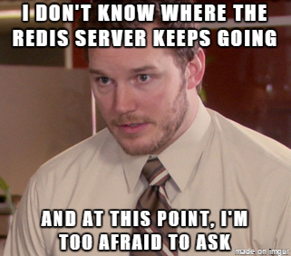

## About
A queuing system refers to a concept used to model and analyze how tasks, jobs, or requests are managed and processed in a sequential manner. It's analogous to a physical queue or line of people waiting their turn in various real-world scenarios. In this project, we will  look at how to  use queuing mechanims in javascript 

## Resources
1. [Getting started with redis](https://redis.io/docs/getting-started/)
2. [Redis cli](https://redis.io/docs/ui/cli/)
3. [Redis client for nodejs](https://github.com/redis/node-redis)
4. [Kue](https://github.com/Automattic/kue) deprecated but still use in the industry

## Learning objectives

- [X] How to run a Redis server on your machine
- [X] How to run simple operations with the Redis client
- [X] How to use a Redis client with Node JS for basic operations
- [X] How to store hash values in Redis
- [X] How to deal with async operations with Redis
- [X] How to use Kue as a queue system
- [X] How to build a basic Express app interacting with a Redis server
- [X] How to the build a basic Express app interacting with a Redis server and queue

